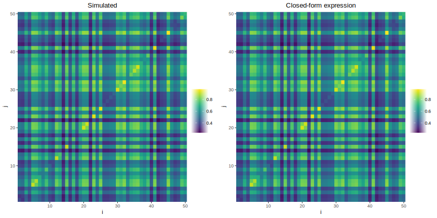
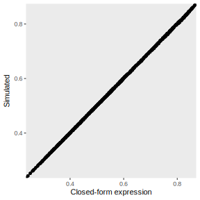

# Similarity between feature vectors

## Simulated vectors

Suppose $P$ different vectors of dimensions $n$. Each vector is generated by drawing values from a normal distribution with standard deviation $\sigma$ fixed to 1.0. Vectors are normalized by their euclidean norm:

$$\left\lvert v_{2} \right\rvert = \sqrt{{v_{i}^{2.0} + ... + v_{n}^{2.0}}}$$

<!-- $$ ||v||_{2} = \sqrt{v_{i}^{2.0} + ... + v_{n}^{2.0}} $$ -->

Via this normalization process, vectors have a dot product of 1.0 with themselves:

$$ v \cdot v = \sum{v_{i} . v_{i}} = 1.0 $$

Vectors have a similarity value $s$ with other vectors. This similarity is measured using the dot product, which thanks to the normalization process, ranges between 0.0 and 1.0.

Vectors can undergo some degradation. This is made by scaling each of their feature by a fixed proportion $D$ which ranges between 0.0 and 1.0. Due to this degradation process, the similarity between vectors will be affected.

The problem of the current project is the following: How does the similarity between vectors change as a function of this degradation process?

## Closed-form expression

To answer this question, we need to first consider a matrix $M$, in which the initial similarity $M_{ij}$ between items $i$ and item $j$ is stored. In this original matrix, all items have a similarity value of 1.0 with themselves, as explained above. 

We furthermore know the degree of degradation for a particular, because this is what is being manipulated. We can track this degradation for each item in a vector $\eta$. In this vector, $\eta_{i}$ is the degree of degradation for item $i$. A value of 1.0 means that the item has been completely degraded. A value of 0.0 means that the item is intact.

Having $M$ and $\eta$, we now want to know the similarity between items $i$ and $j$ after applying the degradation for any of these items. This new similarity is stored in another matrix, $W$. With this, the similarity $W_{ij}$ between item i and item j is:

$$ W_{ij} = (1.0 - \eta_{i}) (1.0 - \eta_{j}) M_{ii} M{ij} $$

## Results

The following figure shows a heatmap representing the similarity between 50 simulated feature vectors after degradation. The left side of the figure shows similarity for feature vectors of dimension 100,000. The right side of the figure shows the equivalent using the closed-form expressions as defined above. As can be seen, both matrices are strikingly similar.

The correspondence between the similarity matrix obtained using the simulated vectors and the similarity matrix obtained using the closed-form expression can be more accurately captured by plotting their correlation:

As can be seen, both matrices correlate almost perfectly, which strongly suggests equivalence between both versions.

## Conclusion

After undergoing some degradation, the similarity between feature vectors can be easily summarized into a closed-form expression, provided that two information are known: (1) the original similarity matrix, and (2) the strength of degradation of each vector.
